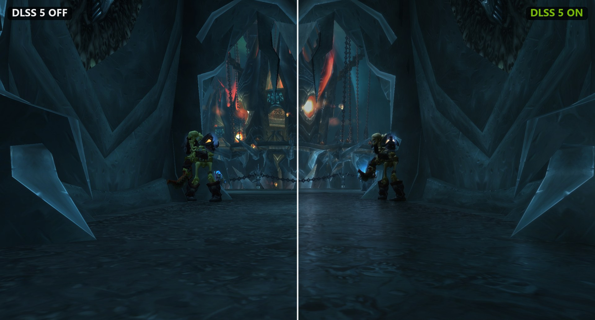
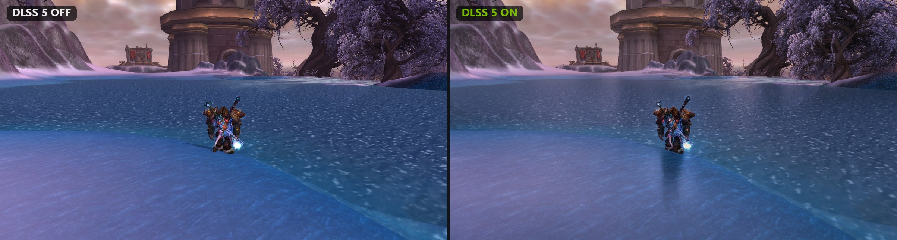
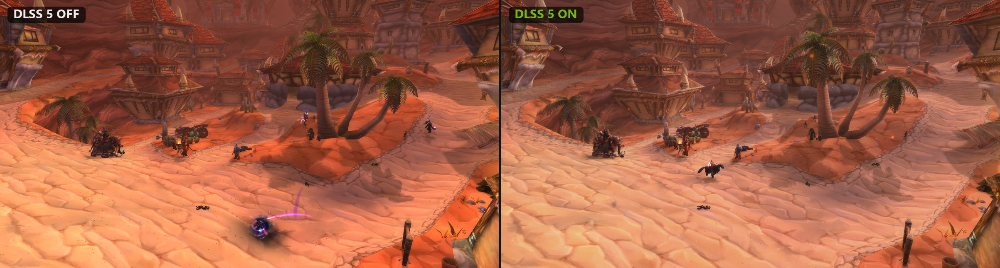
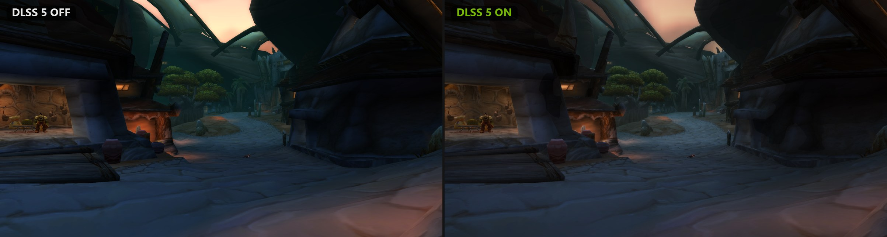
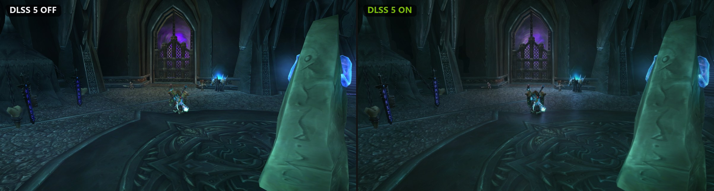
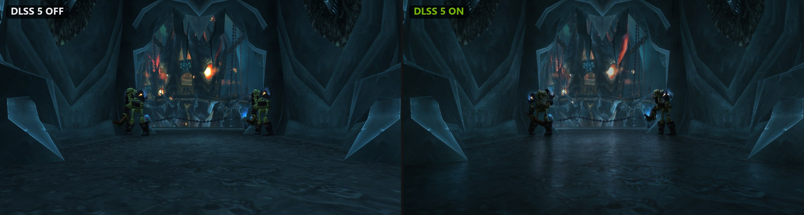

# WoW DLSS 5

[English](README.md) · **Русский**

NVIDIA DLSS 5 Neural Rendering для World of Warcraft 3.3.5a (build 12340). Один установщик с окном настроек. Всё, кроме LumeniteFX, уже внутри — подробности в разделе [Как это работает](#как-это-работает).



## Требования

- Видеокарта NVIDIA **RTX 50** (нейромодель работает только на RTX 50)
- Драйвер NVIDIA **616.56+**, рекомендуется 617.14+
- WoW 3.3.5a с патчем 4 ГБ

## Установка

1. Скачай `WoW-DLSS5.exe` из [Releases](../../releases/latest).
2. Укажи папку, где лежит `Wow.exe`.
3. Выбери **DirectX 11 (dgVoodoo2)** (рекомендуется) и нажми **«Установить»**.
4. Запускай WoW как обычно.

В игре:

- **Pause** — DLSS 5 вкл/выкл для сравнения.
- **Home** — меню ReShade.

**«Удалить»** возвращает клиент в исходное состояние.

## Скриншоты







## Как это работает

WoW 3.3.5a рисует через Direct3D 9, а DLSS его не поддерживает. Установщик переводит игру на DirectX 11 через dgVoodoo2 или на Vulkan через DXVK. Поверх ставятся:

- ReShade;
- аддон [DLSS5-Feeder](https://github.com/jlrouzies-fr/DLSS5-Feeder), который собирает кадр для DLSS из глубины и векторов движения;
- RenoDX DLSS 5 с рантаймами NVIDIA NGX.

Все версии зафиксированы и вшиты в exe.

Исключение одно — LumeniteFX (векторы движения). Его лицензия разрешает распространение только по ссылкам автора, поэтому установщик скачивает его с GitHub автора по закреплённому коммиту и проверяет каждый файл. Без интернета используется встроенный VORT.

В режиме Vulkan исправлен вылет DLSS5-Feeder 1.17.0 при смене разрешения и выходе из игры ([патч](patches/feeder-1.17.0-vulkan-device-teardown.patch)).

## Важно

- FPS падает примерно вдвое.
- DLSS 5 улучшает свет и материалы. Модели и текстуры не меняются.
- ReShade и DXVK — сторонний софт в клиенте, так что сверься с правилами своего сервера.

## Сборка

Нужен .NET 9 SDK и файлы из [vendor/README.md](vendor/README.md) в папке `vendor\`. Потом:

```
powershell -ExecutionPolicy Bypass -File build.ps1
```

Результат — `dist\WoW-DLSS5.exe`.
